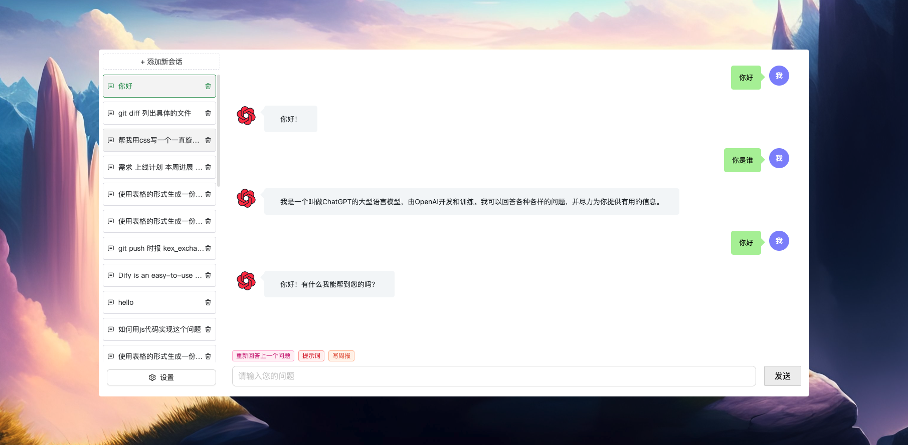
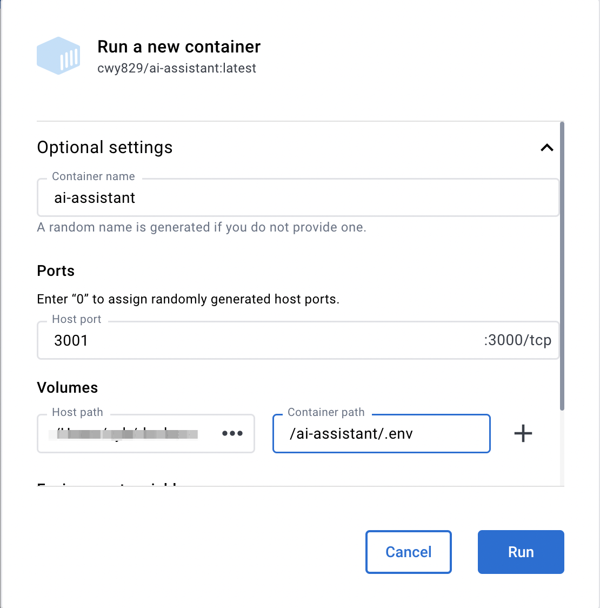

[中文文档](./README_zh.md)

# An AI Assistant

This is an AI project that integrates various open source AI capabilities.

## Project Introduction



Let everyone have the ability to use AI.

## Node Version

Node version >= 18 is required.

## Environment Variables

In root directory, copy an `.env.example` file and rename it to `.env`, then modify its fields:

```
# OpenAI API Key - https://platform.openai.com/account/api-keys
OPENAI_API_KEY=

# PROXY_ADDRESS represents an http proxy. If left blank or not passed any value,
# it means that the http proxy is not enabled.
PROXY_ADDRESS=

# change this to an `accessToken` extracted from the ChatGPT site's
# `https://chat.openai.com/api/auth/session` response
OPENAI_ACCESS_TOKEN=

# Reverse Proxy - Available on accessToken
# Default: https://ai.fakeopen.com/api/conversation
API_REVERSE_PROXY=

# Third-party service API address
CUSTOM_API_URL=
# Third-party service API may need cookie
CUSTOM_COOKIE=

```

- `OPENAI_API_KEY`: Indicates that official OpenAI APIs will be used to access chatgpt.
- `PROXY_ADDRESS`: Scientific Internet access proxy configuration, for example: http://xxx.
- `OPENAI_ACCESS_TOKEN`: OpenAI's [access_token](https://chat.openai.com/api/auth/session), The field usually use with `API_REVERSE_PROXY`，Indicates that unofficial APIs will be used to access chatgpt.
- `API_REVERSE_PROXY`: Indicates available unofficial reverse proxies. By default it adopts "https://ai.fakeopen.com/api/conversation". For details please refer [transitive-bullshit 大佬](https://github.com/transitive-bullshit/chatgpt-api/tree/main#reverse-proxy).
- `CUSTOM_API_URL`: Indicates the third party support service url.
- `CUSTOM_COOKIE`: Indicates the third party may need `cookie` info.

> Priority: `OPENAI_API_KEY` > `OPENAI_ACCESS_TOKEN` > `CUSTOM_API_URL`。

## How to Develop?

### Local development

1. Add a new [.env](#environment-variables) file locally and configure the corresponding parameters.
1. First install dependencies, install code using `pnpm i` in the root directory.
1. Start the project: execute `npm run dev` in the root directory.
1. Access the project address: `http://localhost:3000`.

### Get from Docker

[Get from here](https://hub.docker.com/r/cwy829/ai-assistant)

#### Get Image

```
docker image pull cwy829/ai-assistant
```

#### Start Container

> In the command below, `~/docker-data/.env` needs to be replaced with the address where your `.env` file is located.
> For more information on `.env`, please refer to [here](#environment-variables).

```
docker run -d -p 3000:3000 -v ~/docker-data/.env:/ai-assistant/.env --name ai-assistant cwy829/ai-assistant
```

#### Docker client startup configuration



For more information about Docker, please refer to the [documentation](./DOCKERHELP.md).

## How to Use?

### Method 1: One-click Startup

Execute `npm start` in the root directory.

### Method 2: Separate Front-end and Back-end Startup

1. Start front-end:`pnpm run dev:fe`.
2. Start back-end:`pnpm run dev:be`.
3. Access front-end project address:`http://localhost:8000`.
